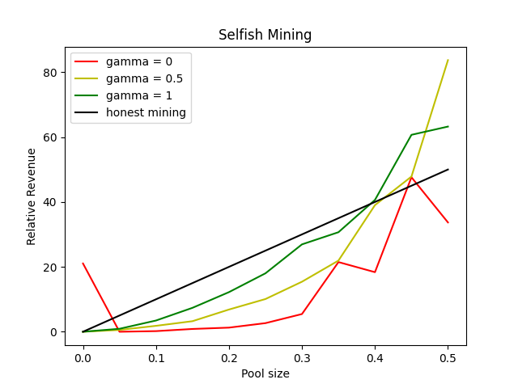

# SelfishMining & Nik Defense
Various Selfish Mining Strategies & A New Proposed Defense Mechanism

This repository contains various strategies for the selfish mining attack in proof-of-work based consensus algorithms including:
- The strategy we refer to as SelfishMining1 was originally published in 2013 by Eyal and Sierer under the name [Majority is not Enough](https://www.cs.cornell.edu/~ie53/publications/btcProcFC.pdf).
- The next strategy we implemented is called [Optimal Selfish Mining](https://arxiv.org/pdf/1507.06183.pdf). It was originally published in 2013 by Sapirshtein, Yonatan Sompolinsky, and Aviv Zohar.

Additionally, it presents our newly proposed defense mechanism against this attack, named "Nik Defense." Compared to previous defense mechanisms, Nik Defense utilizes a novel reinforcement-based mechanism to strengthen the consensus mechanism and prevent such attacks. It is worth mentioning that this is the first defense mechanism in literature to use an AI algorithm against the selfish mining attack. The repository offers a complete implementation of Nik Defense, and the draft paper can be found on arXiv:

[https://arxiv.org/abs/2301.11463](https://arxiv.org/abs/2301.11463)

# Output

```sh
********************************************
alpha is : 0.45
gamma is : 0.5
honest miners win block is : 2998
selfish miners win block is : 3459
total mined block is : 6457
total stale block is : 3543
honest miner revenue is : 46.430230757317645
selfish miner revenue is : 53.56976924268236
honest miner expected reward is : 55.0
selfish miner expected reward is : 45.0
********************************************
********************************************
alpha is : 0.0
gamma is : 0
honest miners win block is : 12996
selfish miners win block is : 3462
total mined block is : 16458
total stale block is : -6458
honest miner revenue is : 78.96463725847612
selfish miner revenue is : 21.03536274152388
honest miner expected reward is : 100.0
selfish miner expected reward is : 0.0
********************************************
```
<br>

# Graph




# Citing
If you find Nik defense to be useful in your research, we kindly request that you cite it as a reference in the following form:

```sh
@article{Nikhalat2023Nik,
  title={Nik Defense: An Artificial Intelligence Based Defense Mechanism against Selfish Mining in Bitcoin},
  author={Nikhalat-Jahromi, Ali and Saghiri, Ali Mohammad and Meybodi, Mohammad Reza},
  journal={arXiv e-prints},
  pages={arXiv--2301},
  year={2023}
}
```

# Contribution
We always welcome new brilliant ideas and appreciate your contributions.
